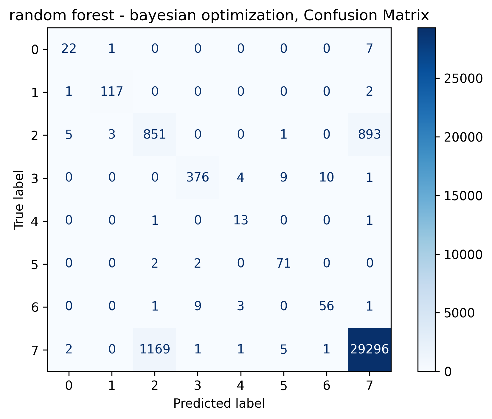

# Springboard Capstone Two  
## Classifying San Francisco Building Permit Types Using Machine Learning  
**Author:** Benoit Loze  
**Date:** July 18, 2025  

---
## Project Overview  
This project builds a supervised machine learning model to classify San Francisco building permit types (e.g., New Construction, Electrical, Plumbing) based on structured features such as cost estimates, zoning, building size, and contractor info.

Using the 2013–2018 Kaggle dataset, the goal is to streamline permit handling by municipal offices through accurate automation — targeting ≥80% accuracy.
---

## Dataset  
- **Source:** Kaggle (San Francisco Open Data)  
- **Time Period:** 2013–2018  
- **Features Used:** Cost estimates, number of stories, zoning district, dates, contractor license type, construction types  
- **Target Variable:** `Permit Type` (8-class classifion)

---

## Workflow  
1. **Data Wrangling**: Cleaned nulls, handled duplicates, imputed missing values, removed outliers  
2. **EDA**: Skewed features transformed (e.g., cost), log transformations applied  
3. **Preprocessing**:  
   - One-hot encoding for regression models  
   - Target encoding for tree-based models  
   - Stratified train/test split  
   - Scaling applied only to regression models  

4. **Modeling**:  
   - **Multinomial Logistic Regression**  
   - **Random Forest** (with Randomized &yesian Optimization)

---

## Final Model: Random Forest (Bayesian Optimization)  
- **F1 Score:** 0.81  
- **Precision:** 0.79  
- **Recall:** 0.84  
- Handles severe class imbalance (dominance of class 7)  
- Balanced prediction across classes.

---

## Key Takeaways  
- Tree-based models outperform logistic regression on imbalanced, multi-class data  
- Bayesian optimization offers better recall-precision balance  
- Automating permit classification can assist city offices in prioritization, anly detection, and workload reduction  

---

## Deliverables  
- Fully documented Jupyter Notebook  
- Final model + preprocessing pipeline  
- Performance metrics (.txt) + cosion matrix (.png)  
- Executive slide deck  

---

## Constraints  
- Missing and inconsistent entries  
-y class imbalance  
- Assumes clean target labeling  

---

> **Next steps**: Consider deploying the model as an internal classification tool with UI integration to assist permit reviewers.
